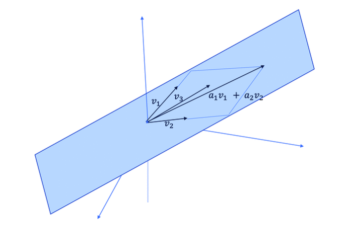
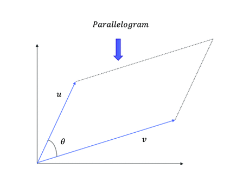

# Linear Algebra

## Vector

## Scalar

## Matrix

## Tensor

## Matrix Operations and Manipulations

m행 n열 행렬 A 는 식 (1)과 같이 표현 한다
$$
A_{m \times n} \in \mathbb{R}^{m \times n}
$$

### 행렬의 덧셈

두 행렬 A, B 의 덧셈은 각 행렬의 원소끼리의 덧셈이다.

만약 행렬 C가 두 행렬 A, B의 덧셈의 결과라면
$$
c_{ij}=a_{ij} + b_{ij} \qquad \forall i \in \{1, 2, ..., m\}, \forall j \in \{1, 2, ..., n\} \qquad where\ a_{ij} \in A, b_{ij} \in B, c_{ij} \in C
$$

### 행렬의 뺄셈

두 행렬 A, B의 뺄셈은 각 행렬의 원소끼리의 뺄셈이다.

만약 행렬 C가 두 행렬 A, B의 뺄셈의 결과라면
$$
c_{ij} = a_{ij} - b_{ij} \qquad \forall i \in \{1,2, ..., m \}, \forall j \in \{1, 2, ..., n\} \qquad where\ a_{ij} \in A, b_{ij} \in B, c_{ij} \in C
$$

### 두 행렬의 곱셈 (Product of Two Matrices)

두 행렬 $A \in \mathbb{R}^{m \times n}$와 $B\in \mathbb{R}^{p \times q}$에 대해 곱하기가 성립하려면 n과 p가 같아야 한다.

만약 행렬 C가 두 행렬 A, B의 곱셈의 결과라면
$$
c_{ij} = \sum_{k=1}^{n}a_{ik}b_{kj} \qquad \forall i \in \{1,2,...,m\}, \forall j \in \{1,2,...,q\}
$$
[행렬의 곱셈 예제 추가]

### 전치 행렬

행렬 $A \in \mathbb{R}^{m \times n}$ 의 전치 행렬은 $A^T \in \mathbb{R}^{n \times m}$ 으로 표기하고 행 백터를 열벡터로 변환한다.
$$
\acute{a}_{ji}=a_{ij} \qquad \forall i \in \{1,2,...,m\}, \forall j \in \{1,2,...n\} \quad where\ \acute{a}_{ji} \in A^T and\ a_{ij} \in A
$$
[행렬의 치환 예제 추가]

### 벡터의 내적

n 차원 백터를 행렬로 표현하면 $\mathcal{V} \in \mathbb{R}^{n \times 1} $이다. 두 벡터를 $\mathcal{V}_1, \mathcal{V}_2$가 다음과 같다면
$$
\mathcal{V}_1 = 
\begin{bmatrix}
\mathcal{V}_{11} \\
\mathcal{V}_{12} \\
\vdots \\
\mathcal{V}_{1n}
\end{bmatrix},

\mathcal{V}_2 = 
\begin{bmatrix}
\mathcal{V}_{21} \\
\mathcal{V}_{22} \\
\vdots \\
\mathcal{V}_{2n}
\end{bmatrix}
$$
두 벡터의 내적은 대응하는 원소의 곱셈의 합이다.
$$
\mathcal{V}_1 \cdot \mathcal{V}_2 = \mathcal{V}_1^T \mathcal{V}_2 = \mathcal{V}_2^T \mathcal{V}_1 = \mathcal{V}_{11}\mathcal{V}_{21} + \mathcal{V}_{12}\mathcal{V}_{22} + 
\cdots + \mathcal{V}_{1n}\mathcal{V}_{2n} = \sum_{k=1}^n \mathcal{V}_{1k}\mathcal{V}_{2k}
$$

### 행렬과 벡터의 곱

행렬과 백터의 곱셈 결과로 새로운 벡터가 생성된다.

행렬 $A \in \mathbb{R}^{m \times n}$ 와 벡터 $x \in \mathbb{R}^{n \times 1}$의 곱셈은 새로운 벡터 $b \in \mathbb{R}^{m \times 1}$를 생성한다.
$$
A = 
\begin{bmatrix}
c_1^{(1)}c_1^{(2)}\cdots c_1^{(n)} \\
c_2^{(1)}c_2^{(2)}\cdots c_2^{(n)} \\
\vdots
c_m^{(1)}c_m^{(2)}\cdots c_m^{(n)} \\
\end{bmatrix}, 
\ x = 
\begin{bmatrix}
x_1 \\
x_2 \\
\vdots \\
x_n 
\end{bmatrix}
$$
행렬 A는 n 개의 컬럼 벡터($c^{(i)} \in \mathbb{R}^{m \times 1} \qquad \forall i \in \{1,2,3,...,n\}$)로 이루어져 있다.
$$
A = [c^{(1)}c^{(2)}c^{(3)}\cdots c^{(n)}] \\
b = Ax = [c^{(1)}c^{(2)}c^{(3)}\cdots c^{(n)}]
\begin{bmatrix}
x_1 \\
x_2 \\
\vdots \\
x_n
\end{bmatrix}
= x_1c^{(1)} + x_2c^{(2)} + \cdots x_nc^{(n)}
$$
컬럼벡터와 행렬의 선형 조합이고 벡터 $x​$ 의 요소는 선형 계수이다.

행렬의 곱셈으로 생성된 새로운 백터는 행렬 A 의 컬럼 백터와 동일한 차원을 갖는다. 즉 우리가 얼마나 많은 컬럼 백터를 조합하는지와 상관 없이 컬럼 벡터에 의해 확장된(spanned) 공간을 떠날 수 없다.

### 벡터의 선형 독립

벡터가 다른 벡터의 선형 조합으로 표현 가능하다면 그 벡터는 선형 종속이라고 이야기 한다.

예를 들어 $\mathcal{V}_1=5\mathcal{V}_2 + 7\mathcal{V}_3$ 이라면 $\mathcal{V}_1, \mathcal{V}_2, \mathcal{V}_3$ 은 선형 독립이 아니다. 왜냐하면 $\mathcal{V}_1$이 $\mathcal{V}_2$와 $\mathcal{V}_3$의 덧셈으로 표현 가능하기 때문이다.

일반적으로 $n​$ 개의 벡터로 이루어진 집합($\mathcal{V}_1,\mathcal{V}_2,\mathcal{V}_3,\cdots , \mathcal{V}_n \in \mathbb{R}^{m \times 1}​$)은 $a_1\mathcal{V}_1 + a_2\mathcal{V}_2 + a_3\mathcal{V}_3 + \cdots + a_n\mathcal{V}_n=0 이고 a_i=0 \quad \forall i \in \{1,2,\cdots n\}​$를 만족하는 경우만 선형 독립이라고 말한다.

$a_1\mathcal{V}_1 + a_2\mathcal{V}_2 + a_3\mathcal{V}_3 + \cdots + a_n\mathcal{V}_n=0$ 이고 모든 $a_i=0$ 아니면 벡터는 선형 독립이 아니다.

아래 방법을 사용하면 주어진 벡터 집합이 선형 독립인지 아닌지 확인할 수 있다.

$a_1\mathcal{V}_1 + a_2\mathcal{V}_2 + a_3\mathcal{V}_3 + \cdots + a_n\mathcal{V}_n=0$는 아래와 같이 식을 다시 정리할 수 있다.
$$
[\mathcal{V}_1\ \mathcal{V}_2\ \mathcal{V}_3\ \cdots\ \mathcal{V}_n]
\begin{bmatrix}
a_1\\
a_2\\
\vdots \\
a_n
\end{bmatrix} = 0 \qquad
where \mathcal{V}_i \in \mathbb{R}^{m \times 1},
\qquad
\forall i \in \{1,2,\cdots , n\},
\begin{bmatrix}
a_1 \\
a_2 \\
\vdots \\
a_n
\end{bmatrix} \in \mathbb{R}^{n \times 1}
$$
위 식을 만족하는 유일한 해가 영벡터라면 벡터 집합($\{v_1, v_2, \cdots , v_n\}$)은 '선형 독립이다'라고 말한다.

만약 $n$ 벡터 집합이 선형 독립이라면 그런 벡터는 전체 n 차원 공간을 생성(span)한다. 즉, n 개의 벡터로 선형 조합을 하면 n 차원 공간에서 있는 모든 벡터를 생성할 수 있다는 것을 의미한다. 만약 n 개의 벡터가 선형 독립이 아니면 n 차원의 부분 공간만 생성한다.

*벡터 생성(span)*

[ 그림 상세 설명 예제 추가]

### 행렬 계수

행렬 계수는 선형 독립인 컬럼 벡터 또는 로우 벡터의 개수이다. 행렬에서 독립인 컬럼 벡터의 개수는 독립인 로우 벡터의 개수와 같다.

행렬 계수는 다음과 같은 특성이 있다.

* 정방 행렬 $A \in \mathbb{R}^{n \times n}$ 에 대해 행렬 A 의 계수(rank) 가 n 이라면 full rank 라고 합니다.

[정리 추가]

### 항등 행렬[연산]

행렬 $I \in \mathbb{R}^{n \times n}$ 에 대해 임의의 행렬 또는 벡터를 곱했을 대 행렬 또는 벡터가 변하지 않으면 $I$ 를 항등 행렬 또는 항등 연산이라고 한다. 3 \times 3 항등 행렬은 다음과 같다.
$$
I = \begin{bmatrix}1 & 0 & 0 \\ 0 & 1 & 0 \\ 0 & 0 & 1 \end{bmatrix} \in \mathbb{R}^{3 \times 3}
$$
행렬의 곱셈은 항등 행렬에 대해서는 교환 법칙이 성립한다.

### 행렬식

정방 행렬 $A$의 행렬식은 숫자값을 갖으며  $det(A)$라고 표기한다.

[행렬식의 물리적인 의미에 대해서 추가 설명]

다음과 같은 행렬 A 가 있다고 하자. 
$$
A = \begin{bmatrix} a_{11} & a_{12} \\ a_{21} & a_{22} \end{bmatrix} \in \mathbb{R}^{2 \times 2}
$$
행렬식은 다음과 같다.
$$
det(A) = \begin{vmatrix} a_{11} & a_{12} \\ a_{21} & a_{22} \end{vmatrix}
= a_{11}a_{22} - a_{12}a_{21}
$$
유사하게 $B \in \mathbb{R}^{3 \times 3}$ 행렬의 행렬식은 다음과 같다
$$
B=
\begin{bmatrix}
a_{11} & a_{12} &a_{13} \\
a_{21} & a_{22} &a_{23} \\
a_{31} & a_{32} &a_{33} \\
\end{bmatrix}
\in \mathbb{R}^{3 \times 3}
$$

$$
det(B) = 
a_{11}\begin{vmatrix}a_{22} & a_{23} \\ a_{32} & a_{33} \end{vmatrix} -
a_{12}\begin{vmatrix}a_{21} & a_{23} \\ a_{31} & a_{33} \end{vmatrix} +
a_{13}\begin{vmatrix}a_{21} & a_{22} \\ a_{31} & a_{32}
\end{vmatrix}
$$

$$
where \qquad det\left(\begin{bmatrix}a_{22} & a_{23} \\ a_{32} & a_{33} \end{bmatrix}\right)
$$

[n 차원 행렬의 행렬식 구하는 일반화 공식 추가]

#### 행렬식의 해석

행렬식의 절대값은 경계선처럼 동작하는 행벡터로 둘러 쌓인 볼륨을 결정한다.

*행렬식의 물리적인 의미*

$A \in \mathbb{R}^{2 \times 2}$ 인 행렬에 대해 행렬식은 두 행벡터가 경계선인 평행사변형의 면적이다

예를 들어 $A=\begin{bmatrix}a & b \\ c & d\end{bmatrix}$ 라면 $det(A)$ 는 벡터 $u=\begin{bmatrix}a & b\end{bmatrix}^T$ 와 $v=\begin{bmatrix}c & d\end{bmatrix}^T$ 를 선으로 하는 평행사변형의 넓이와 같다. 평행 사변형의 넓이는 $|u||v|\sin \theta$ 이고 $\theta$ 는 두 벡터 $u, v$ 사이의 각이다.
$$
\left| u \right|\left| v \right| \sin \theta = \sqrt{a^2 + b^2}\sqrt{c^2 + d^2}\frac{(ad-bc)}{\sqrt{a^2 + b^2}\sqrt{c^2 + d^2}} = (ad-bc)
$$
유사하게 $B \in \mathbb{R}^{3 \times 3}$ 인 행렬의 행렬식은 세 개의 행벡터를 선분으로 하는 평행 육면체의 부피다.

### 역행렬

정방행렬 $A \in \mathbb{R}^{n \times n}$ 의 역행렬은 $A^{-1}$ 로 표기하며 $A$ 와 $A^{-1}$ 의 곱셉의 결과는 항등행렬. $I \in \mathbb{R}^{n \times n}$ 이다.
$$
AA^{-1} = A^{-1}A = I
$$
모든 정방행렬이 역행렬을 갖지는 않는다. 역행렬은 다음과 같이 계산한다.
$$
A^{-1} = \frac{adjoint(A)}{det(A)} = \frac{(cofactor\ matrix\ of A)^T}{det(A)}
$$
만약 정방행렬($A \in \mathbb{R}^{n \times n}$)이 특이행렬 이라면(행렬 $A$가 $n$ 개의 선형 독립인 행벡터 또는 열벡터를 갖지 않는다면) $A$의 역행렬은 존재하지 않는다. 왜냐하면 특이행렬의 행렬식($det(A)=0$)은 0이고 행렬식이 0이면 역행렬이 정의 되지 않는다.

### 벡터의 노름(Norm of Vector)

벡터의 노름은 벡터의 크기를 나타내는 지표다. 벡터의 크기를 계산하는 방법은 여러가지가 있다. 가장 잘 알려진 방법은 유클리디안 노름($\mathcal{L}^2$ 노름)이다.

벡터 $x \in \mathbb{R}^{n \times 1}$ 에 대해 $\mathcal{L}^2$ 노름은 다음과 같이 정의 한다.
$$
\lVert x\rVert_2 = (\left|x_1\right|^2 + \left|x_2\right|^2 + \left|x_3\right|^2 + \cdots + \left|x_n\right|^2)^{\frac{1}{2}} = (x \cdot x)^{\frac{1}{2}} = (x^T x)^{\frac{1}{2}}
$$
유사하게 $\mathcal{L}^1$ 노름은 벡터의 각 요소의 절대값의 합이다.
$$
\lVert x\rVert_1 = \left|x_1\right| + \left|x_2\right| + \left|x_3\right| + \cdots + \left|x_n\right|
$$

##### 정리해야 할 내용

* 선형 조합의 정의와 의미

# 참조

Pro Deep Learning with TensorFlow

[행렬식의 기하학적인 의미](https://wikidocs.net/4049)