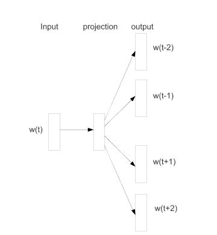

# Introduction

* 백터 공간에서 단어의 분산 표현은 자연어처리에 성능을 높이기 위해 도움이 된다
* 최초의 사용은 1986년으로 거슬러 올라간다.
  * 확률적 언어 모델(statistical language modeling)에 적용해서 상당한 성과를 거두고 있다.
  * 확률론적 언어 모델은 automatic speech recognition, machine translation과 같은 다양한 NLP 작업에 활용되고 있다.
* 방대한 양의 unstructured text data로 부터 고품질(?)의 백터 표현(vector representation)을 학습하기 위한 효률적인 방법이 소개됐다.(skip-gram model)
* skip-gram 모델은 이전의 방법과 다르게 언어를 백터 공간으로 변환하는 과정에서 dense matrix multiplication이 필요하지 않다. 이로인해 학습을 효과적으로 할 수 있다. 최적화된 단일 머신에서 1000억 단어를 하루에 학습할 수 있다.

*Skip-gram 모델의 학습 목적은 단어들 사이에 주변 단어를 예측할 수 있는 백터 표현을 배우는 것이다.*

* Skip-gram 모델의 몇 가지 확장에 대해 설명한다
  * 학습 과정에서 출연 빈도가 높은 단어를 subsampling을 하면 2~10배의 속도 향상이 있다.
  * 출현 빈도가 낮은 단어의 백터 표현의 정확도를 높일 수 있다.
  * NCE를 단순화한 버전을 설명한다
* Word representations "Boston Globe"와 같은 idiomatic phrases를 표현하는데 제약이 있다. 이런 문제를 해결하기 위해 phrase 를 백터로 표현하는 방법이 있다.
* phrase 백터로 확장하는 것은 상대적으로 간단하다.
* 데이터 기반의 많은 양의 phrase를 구분하고 학습 과정에서 phrase 를 개별 토큰으로 다룬다.
* 백터의 덧샘, 뺄샘 연산이 단어에도 적용됨을 알 수 있다.
  * 예) vec("Russia") + vec('river') = vec(Volga River)

# The Skip-gram Model

* skip-gram 모델 훈련 목적은 문장 혹은 문서에서 단어를 둘러싸고 있는 단어를 예측하기 위해 유용한 백터 표현을 찾는 것이다.

* 주어진 단어 나열($w_1, w_2, w_3, \cdots , w_T$)에서 평균 로그 확률을 최대화 하는 것이 Skip-gram Model 의 목적
  $$
  \frac{1}{T} \sum_{t=1}^{T} \sum_{-c \le j \le c, j \neq0}\log p(w_{t+j}|w_t)
  $$

  * $c$는 훈련 맥락(중심 단어 $w_t$의 함수가 될 수 있음)의 크기
  * $c$를 크게 하면 더 많은 훈련 데이터가 필요하고 정확도를 더 높일 수 있지만 훈련시간은 더 많이 소요된다

* 기본 Skip-gram 수식에서 정의하는 p(w_{t+j}|w_t)는 softmax 함수를 사용한다.
  $$
  p(w_O|w_I) = \frac{\exp\left( v_{w_O}^{'T}v_{w_I} \right)}{\sum_{w=1}^{W} \exp \left( v_{w}^{'T}v_{w_I}\right)}
  $$
  
  * $v_w$와 $v_w^{'}$는 $w$의 입력과 출력 백터 표현이다.
  * $W$ 는 사전에 있는 단어의 갯수이다.

* 이 함수를 사용하는 것은 실용적이지 않다. 왜냐하면 $\triangledown \log p(w_O|w_I)$의 계산 비용이 $W$에 비례해서 증가하기 때문이다.

## Hierarchical Softmax

나중에 정리(word2vec에서는 사용하지 않음)

## Negative Sampling

* 계층적 소프트맥스의 대안이 Noise Contrastive Estimation(NCE) 이다.

* NCE는 좋은 모델은 로지스틱 회귀를 사용해서 노이즈와 데이터를 구분할 수 있어야 함을 상정한다.

* NCE는 소프트 맥스 함수의 로그 확률을 최대화 하는 것으로 볼 수 있지만 Skip-gram 모델은 높은 품질의 백터 표현만 고려하기 때문에 백터 표현의 품질이 유지되는 선에서는 NCE를 단순화하는 것에서 자유롭다.

* $(3)$과 같이 Negative Sampling(NEG)을 정의 한다.
  $$
  \log \sigma(v_{w_O}^{'T}v_{w_I}) + \sum_{i=1}^{k}\mathbb{E}_{w_i} \sim P_n(w) \left[\log \sigma(-v_{w_i}^{'T}v_{w_I}) \right]
  $$

* Skip-gram 목적 함수에서 $\log P(w_O|w_I)$ 를 $(3)$을 사용해서 대체한다.
* 그러면 작업은 로지스틱 회귀를 통해 노이즈 분포 $P_n(w)$ 에서 $w_O$를 구분하는 문제가 된다.
  
  * 데이터 샘플에는 $k$ 개의 negative sample이 있다

## Subsampling of Frequent Words

* 단어 사전이 큰 경우 출현 빈도가 높은 단어는 수백만번 나타나기도 한다.

* 출현 빈도수가 높은 단어는 출현 빈도수가 낮은 단어에 비해 적은 정보량을 갖는다.

* 반대로 생각하면 학습에서는 출현 빈도가 많은 단어를 학습에 사용해도 백터 표현의 변화에 크게 영향을 미치지 않는다.

* 출현 빈도가 높은 단어와 낮은 단어의 불균형을 계산하기 위해 단순한 표본 추출(subsampling)을 사용한다.

* 훈련 집합에서 각 단어 $w_i$는 $(4)$에 따라 제거 된다.
  $$
  P(w_i) = 1 - \sqrt{\frac{t}{f(w_i)}}
  $$
  * $f(w_i)$ 는 단어 $w_i$ 의 출현 빈도
  * $t$ 는 임의의 임계값($10^{-5}$ 정도의 값)

* 출현 빈도의 순위는 유지하면서 $t$ 보다 출현빈도가 큰 단어들은 적극적으로 표본 추출을 하기 때문에 $(4)$를 사용한다.

# Empirical Results

* HS, NCE, NEG, Subsampling을 비교한다.
* 유비 추론 문제에 알고리즘을 적용했다.
* 문제의 예제는 다음과 같다. "독일":"베를린"::"프랑스":?
* 코사인 유사도에 따라 vec(베를린) - vec(독일) + vec(프랑스) 와 비슷한 문제에서 백터 x를 찾는 문제와 같다.
* 구문적 추론과 의미적 추론 문제로 구성되어 있음